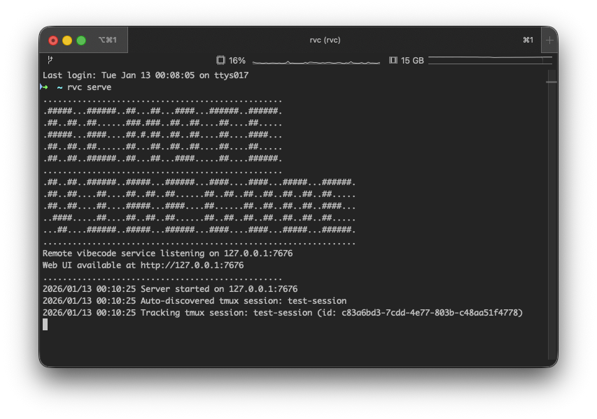

```
.................................................
.#####...######..##...##...####...######..######.
.##..##..##......###.###..##..##....##....##.....
.#####...####....##.#.##..##..##....##....####...
.##..##..##......##...##..##..##....##....##.....
.##..##..######..##...##...####.....##....######.
.................................................
.##..##..######..#####...######...####....####...#####...######.
.##..##....##....##..##..##......##..##..##..##..##..##..##.....
.##..##....##....#####...####....##......##..##..##..##..####...
..####.....##....##..##..##......##..##..##..##..##..##..##.....
...##....######..#####...######...####....####...#####...######.
................................................................
```

[](https://golang.org/)
[](LICENSE)

# Remote Vibecode [WIP]

A web dashboard for viewing and interacting with terminal sessions in real-time. Access your terminal from any browser, share sessions with teammates, and manage multiple terminal environments from a single interface.

Built on tmux and gotty, Remote Vibecode provides a clean, modern web interface for terminal sharing and remote access.

## What is Remote Vibecode?

Remote Vibecode transforms your terminal into a shareable, browser-accessible workspace. Whether you're pair programming, providing remote support, teaching workshops, or managing multiple server sessions, Remote Vibecode gives you a centralized dashboard for all your terminal needs.



## Motivation

When running extended vibe coding sessions with long planning and implementation phases, you shouldn't have to stay tethered to your computer to review, accept, or revise the coding tool's processes. Remote Vibecode gives you the freedom to monitor and control your development session from any device—whether you're on the same local network or connected via mobile network through VPN or Cloudflare Tunnel. Continue your work uninterrupted even when you step away from your desk.

## How It Works

Remote Vibecode runs a web server that connects to your terminal sessions using tmux. The web interface uses xterm.js for full terminal emulation and communicates over WebSockets using the gotty protocol.

```
Browser (xterm.js) <---> WebSocket (gotty protocol) <---> tmux session
```

## Features

- **Real-time Terminal Access** - Full terminal emulation in your browser
- **Read-Only Sessions** - Sessions are read-only by default for safe viewing
- **Writable Sessions** - Use `-w` flag to allow web clients to type
- **Auto-discovery** - Sessions appear automatically as you create them
- **Multi-session Support** - Manage multiple sessions with a sidebar navigation
- **Responsive Design** - Works on desktop, tablet, and mobile
- **UTF-8 Support** - Full Unicode character support
- **Keepalive Connections** - Stable WebSocket connections with ping/pong

## Prerequisites

- macOS with Homebrew
- tmux (installed automatically by Homebrew)

## Installation

```bash
brew tap ibrahimsn98/homebrew-remote-vibecode
brew install rvc
```

## Quick Start

### Step 1: Start the Web Server

```bash
rvc serve
```

The server runs on http://localhost:7676 by default.

### Step 2: Start a Session

In a new terminal:

```bash
rvc start my-project
```

This creates a **read-only** session - viewers can see but not type.

### Step 3: Open in Browser

Navigate to http://localhost:7676 and click on your session to connect.

That's it! You now have a browser-based terminal connected to your session.

## CLI Reference

### Start the Web Server

```bash
rvc serve [--host 127.0.0.1] [--port 9000]
```

Starts the web server for remote terminal viewing.

**Options:**
- `--host` - Host to bind to (default: 127.0.0.1)
- `--port` - Port to listen on (default: 7676)

**Examples:**
```bash
rvc serve                                    # Default: 127.0.0.1:7676
rvc serve --host 0.0.0.0                     # Allow network access
rvc serve --port 7676                        # Custom port
rvc serve --host 127.0.0.1 --port 7676       # Both custom
```

### Start a New Session

```bash
rvc start <session-name> [-w]
```

Creates and starts a new named tmux session.

**Options:**
- `-w, --writable` - Create a writable session (web clients can type)

**Examples:**
```bash
rvc start frontend           # Read-only session (default)
rvc start -w backend         # Writable session
rvc start database -w        # Writable session
```

### List Sessions

```bash
rvc list
```

Shows all active tmux sessions.

### Stop a Session

```bash
rvc stop <session-name> [-f]
```

Stops and removes the specified session.

**Options:**
- `-f, --force` - Skip confirmation prompt

### Join a Session

```bash
rvc join [session-name]
```

Attaches your terminal to an existing session (useful for direct terminal access).

## Usage Examples

### Multiple Sessions for Different Projects

```bash
# Terminal 1: Start the web server
rvc serve

# Terminal 2: Start sessions
rvc start frontend
rvc start -w backend
rvc start database

# Open http://localhost:7676
# Switch between sessions using the sidebar
```

### Read-Only Viewing Session

```bash
# Start a read-only session (default)
rvc start demo-session

# Viewers can see your terminal but cannot type
```

### Writable Collaboration Session

```bash
# Start a writable session
rvc start -w pair-session

# Both you and web viewers can type
# Great for pair programming
```

### Custom Server Configuration

```bash
# Allow access from other devices on your network
rvc serve --host 127.0.0.1 --port 7676

# Access from another device
# http://YOUR_LOCAL_IP:7676
```

## Session Modes

### Read-Only (Default)

Sessions are read-only by default. Web viewers can:
- See everything happening in the terminal
- Scroll through history
- **Cannot** type or execute commands

Perfect for monitoring your vibe coding sessions from other devices while the AI tool runs planning and implementation phases.

### Writable (with `-w` flag)

Sessions created with `-w` allow web clients to type.

Web viewers can:
- See everything
- Type commands
- Interact with the terminal

Use this mode when you need to make quick edits, accept/reject changes, or intervene in the coding process from a remote device.

**Security Note:** Only use writable sessions on trusted networks. See the Security Disclaimer below.

## Configuration

The `rvc serve` command uses CLI flags instead of environment variables:

### Port

```bash
rvc serve --port 9000
```

### Host

```bash
# Local only (default - safest)
rvc serve --host 127.0.0.1

# Allow local network access (see Network Access guide below)
rvc serve --host 0.0.0.0

# Specific network interface
rvc serve --host 192.168.1.100
```

### Combined

```bash
rvc serve --host 0.0.0.0 --port 7676
```

## Network Access Guide

You can run `rvc serve` with `--host 0.0.0.0` to allow connections from other devices on your local network. This is useful for monitoring your vibe coding sessions from a phone, tablet, or another computer.

### Finding Your Local IP

```bash
# macOS/Linux
ipconfig getifaddr en0  # Wi-Fi
ipconfig getifaddr en1  # Ethernet

# Linux (alternative)
ip addr show | grep "inet " | grep -v 127.0.0.1
```

Then access from another device: `http://YOUR_LOCAL_IP:7676`

### ⚠️ CRITICAL SECURITY WARNINGS

**READ THIS CAREFULLY - YOUR TERMINAL SECURITY IS AT RISK**

1. **NEVER expose the rvc port to the internet** - This gives **anyone in the world** full control of your terminal without authentication
2. **0.0.0.0 is for LOCAL NETWORK ONLY** - Your router/firewall MUST block this port from external access
3. **Verify your firewall** - Check that the rvc port is not forwarded or accessible from outside your LAN
4. **Public WiFi = DANGER** - Never use 0.0.0.0 on public networks (coffee shops, airports, etc.)
5. **Writable sessions = RISK** - Writable mode on 0.0.0.0 lets anyone on your network execute commands

### How to Verify Your Network is Safe

```bash
# From a device OUTSIDE your network (like your phone on mobile data, not WiFi):
# Replace 7676 with your actual port if different
curl http://YOUR_PUBLIC_IP:7676

# Should get "Connection refused" or timeout
# If you get a response, YOUR PORT IS EXPOSED TO THE INTERNET - STOP IMMEDIATELY
```

### Best Practice for Remote Access

**The recommended way to access rvc from outside your local network:**

1. **VPN (Recommended)** - Tailscale, WireGuard, or your router's VPN
   - Provides encrypted, authenticated access from anywhere
   - Works seamlessly with rvc on default 127.0.0.1
2. **SSH Tunnel** - `ssh -L 7676:localhost:7676 user@server`
   - Secure port forwarding to your machine
3. **Cloudflare Tunnel** - With Zero Trust authentication enabled
   - Adds authentication layer before accessing rvc

## Security Disclaimer

🔴 **THIS IS A CRITICAL SECURITY WARNING - READ BEFORE USING --host 0.0.0.0**

**Remote Vibecode provides direct terminal access. This is equivalent to giving someone physical access to your computer with the terminal already open.**

### The Danger

When you run `rvc serve --host 0.0.0.0`, **anyone who can connect to that port gets full control of your terminal**:
- They can read everything on your screen
- They can execute any command
- They can access your files
- They can install malware
- They can steal credentials
- They can delete your data

### NO AUTHENTICATION

This tool has **NO built-in authentication**. Anyone who can reach the port can use it.

### PROTECT YOURSELF

1. **Default (127.0.0.1) is safest** - Only your machine can connect
2. **0.0.0.0 requires firewall protection** - Ensure your router blocks external access
3. **NEVER port forward** - Don't expose this to the internet for any reason
4. **Use a VPN for remote access** - Tailscale, WireGuard, or similar
5. **Check your firewall regularly** - Verify the rvc port is not exposed
6. **Beware of writable mode** - Even more dangerous on 0.0.0.0

### FOR REMOTE ACCESS, USE:

- **Tailscale** - Private VPN, easy setup
- **WireGuard** - Lightweight VPN
- **SSH Tunneling** - Secure port forwarding
- **Cloudflare Tunnel + Zero Trust** - Authenticated access

**If you're unsure about network security, stick to the default (127.0.0.1) and use a VPN.**

## Remote Connection Options

For secure remote access to your terminal sessions, use one of the following methods. **Do not expose the service directly to the internet.**

### Option 1: Tailscale VPN (Recommended)

Tailscale creates a private, encrypted network between your devices.

```bash
# Install Tailscale
brew install --cask tailscale

# Login and connect to your tailnet
tailscale up

# Find your Tailscale IP
tailscale ip -4
```

Access using your Tailscale IP: `http://<your-tailscale-ip>:7676`

### Option 2: Cloudflare Tunnel + Zero Trust

Requires authentication, making it safer than direct exposure.

```bash
# Install cloudflared
brew install cloudflared

# Login to Cloudflare
cloudflared tunnel login

# Create a tunnel
cloudflared tunnel create rvc

# Run the tunnel
cloudflared tunnel --url http://localhost:7676
```

Set up Zero Trust access in the Cloudflare dashboard for authentication.

## Troubleshooting

### Server Not Starting

```bash
# Check if port is already in use
lsof -i :7676

# Try a different port
rvc serve --port 9000
```

### Session Not Appearing

```bash
# Verify the session is running
rvc list

# Check the web console for WebSocket errors
# Ensure the server is running
```

### Browser Connection Issues

- Check that http://localhost:7676 is accessible
- Try a different browser
- Check your firewall settings
- Verify the server is running on the expected port

## Development

### Building from Source

```bash
# Clone the repository
git clone https://github.com/ibrahimsn98/remote-vibecode.git
cd remote-vibecode

# Build the binary
cd service && go build -o rvc ./cmd/vibecode

# Run locally
./rvc serve
```

### Project Structure

```
remote-vibecode/
├── service/
│   ├── cmd/vibecode/       # CLI entry point (rvc command)
│   │   ├── main.go         # Main CLI with serve command
│   │   ├── commands/        # CLI subcommands (start, stop, list, join)
│   │   ├── web/            # Embedded web dashboard
│   │   └── internal/
│   │       └── banner/      # Startup banner
│   ├── internal/
│   │   ├── api/            # REST API handlers
│   │   ├── gotty/          # Gotty protocol implementation
│   │   ├── tmux/           # Session management
│   │   ├── session/        # Session tracking
│   │   └── ws/             # WebSocket handlers
│   └── web/                # Source web dashboard (embedded)
└── README.md
```

## Contributing

Contributions are welcome! Please feel free to submit a Pull Request.

1. Fork the repository
2. Create your feature branch (`git checkout -b feature/amazing-feature`)
3. Commit your changes (`git commit -m 'Add some amazing feature'`)
4. Push to the branch (`git push origin feature/amazing-feature`)
5. Open a Pull Request

## License

MIT License - see LICENSE file for details.
